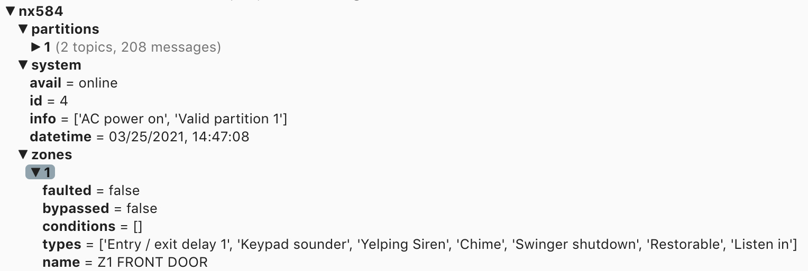

GE/Caddx/NetworX NX584/NX8E Interface Library - MQTT Client & HTTP Server
=========================================================================

This is a tool to let you interact with your GE/Caddx/NetworX alarm panel via
the NX584 module (which is built into NX8E panels). You must enable it
in the configuration of the control panel. 

This package is designed to be a direct replacement for pynx584.
Connection services allow for HTTP server (flask) and/or MQTT client (paho-mqtt).

MQTT provides considerable improvements in zone change latency. Also, since flask is really designed only for development and is considered unstable, HTTP usage is not suggested, but only is provided for backwards-compatibility.

# Installation Details:

[DETAILS](DETAILS.md)

------------------------------------------------
# Improvements:

- Greatly reduced latency for zone and alarm status changes
- Allows for update of alarm time on user request (not just at startup)
- Enhanced security protocol options
- User access to zone and partition flags
- Heartbeat to verify alarm connection is still active

------------------------------------------------
# FUTURE:

------------------------------------------------
# Known Issues:

------------------------------------------------

# BREAKING CHANGES (minimal from pynx584):

- No compatibility with pynx584

